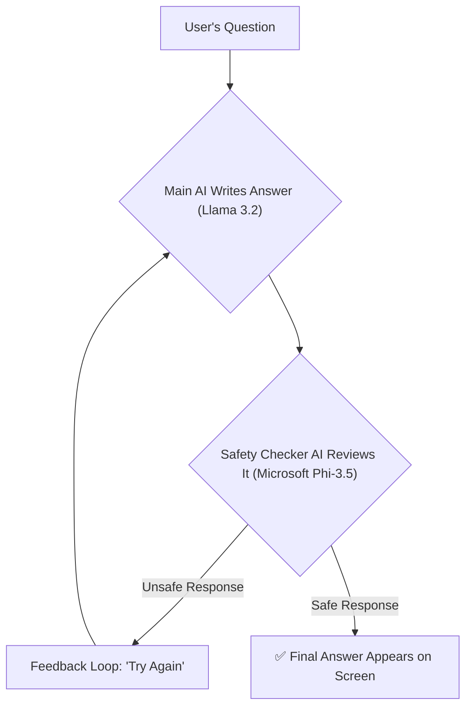

# Minimizing Manipulations in LLMs

This project is a smart safety system for AI chatbots. Its main job is to act like a "guardian," stopping the AI from writing harmful, toxic, or inappropriate responses.
> ### ⚠️ Content Warning
> This repository contains files with examples of harmful and offensive text (specifically in `manipulativePrompts.csv` ). This data is used exclusively for the important work of testing and developing safety measures for AI. Please be aware of this before exploring the files.

---

##  Table of Contents
1.  [The Problem](#-the-problem)
2.  [Our Solution](#-our-solution)
3.  [How It Works](#-how-it-works)
4.  [Key Parts of the System](#-key-parts-of-the-system)
5.  [Benchmark: Why This is Needed](#-benchmark-why-this-is-needed)
6.  [Getting Started: Setup Guide](#-getting-started-setup-guide)
7.  [How to Use the App](#-how-to-use-the-app)
8.  [Project Files Explained](#-project-files-explained)

## The Problem

As AI chatbots become more common, we need to ensure they are safe. A big challenge is that people can sometimes trick these AIs into saying bad things—a practice called "jailbreaking." Our research and testing show that even the most advanced AIs can be vulnerable to these tricks, highlighting the need for an extra layer of security.

## Our Solution

Our LLM is a complete safety net that tackles this problem from two angles:

1.  **Proactive Scanning:** It first checks the user's question with a custom-built "Content Scanner" to see if it's asking for something dangerous *before* the AI even replies.
2.  **Reactive Guardrails:** After the AI writes an answer, a second "Safety Checker" AI double-checks it. If it finds anything unsafe, it tells the first AI to scrap the answer and write a new, safer one.

This entire system is wrapped in a simple web application where you can chat with the protected AI and see the safety features in action.

## How It Works

The system is a clever, two-step process for generating safe AI responses. It uses a main AI to write answers and a second AI to validate them.

Here is a diagram of the workflow:


---

## Key Parts of the System

1. **The Content Scanner (`fusionModel.py`)**  
   - Trained to recognize more than 140 unsafe categories.  
   - Uses DeBERTa-v3 and RoBERTa for high accuracy.  
   - Training dataset: *NVIDIA Aegis AI Content Safety Dataset*.  

2. **The AI Safety Team (`multiAgent.py`)**  
   - **Generator AI:** Llama 3.2 (creative and fluent).  
   - **Validator AI:** Microsoft Phi-3.5 (fast and precise for safety checks).  

3. **The Website Dashboard (`main.py`)**  
   - Built with Streamlit.  
   - Features:  
     - Chat window with the protected AI.  
     - Real-time analysis panels showing safety scans and feedback loops.  

---

## Benchmark: Why This is Needed

Testing revealed serious flaws in advanced AI models:

- **High Jailbreak Rates:** Even top-tier models were jailbroken *over 90% of the time*.  
- **Toxicity & Bias:** Models often generated toxic or stereotypical language.  

This proves the critical need for a guardian system like GuardianLLM.

---

## Getting Started: Setup Guide

### 1. Requirements
- Python 3.8+  
- Git  

### 2. Clone the Project

Open your Git Bash on your computer and run this command:


```
git clone <your-repository-url>
cd <repository-name>
```

### 3. Create a Clean Workspace (Virtual Environment)
This creates a separate space for the project so it doesn't interfere with other Python programs on your computer.

```
# For Mac/Linux
python3 -m venv venv
source venv/bin/activate
```
```
# For Windows
python -m venv venv
.\venv\Scripts\activate
```

### 4. Install All Required Packages
This command installs all the tools the project needs from the requirements.txt file¹².

```
pip install -r requirements.txt
```

### 5. Add Your API
The system needs a free API key from Hugging Face to work. Open the multiAgent.py file¹³. It's best practice to load your key from an environment variable. However, for a quick start, you can find the line `client = InferenceClient(api_key="hf_...")` and replace the `hf_...` part with your own key¹⁴.

## How to Use the App
1. **Prepare the Test Questions**
Run this command to create the manipulativePrompts.csv file¹⁵, which the app uses on the "Prompt Analysis" page.

```
python prompts.py
```

2. **Launch the Website**
Run this command to start the Streamlit web application¹⁶.

```
streamlit run main.py
```
Your web browser should automatically open to a local website where you can start chatting!

## Project Files Explained
.

├── fusionModel.py           # Code to train the AI that scans for unsafe content.

├── guardLLM.py              # Code that uses the trained scanner on new text.

├── llm_fineTuning.py        # Code for testing and fine-tuning various AIs.

├── main.py                  # The code for the main website dashboard.

├── multiAgent.py            # Code for the two AIs (Generator & Validator) that work together.

├── prompts.py               # Script that creates the list of tricky test questions.

├── labels.py                # A list of all 146 unsafe categories the scanner looks for.

├── manipulativePrompts.csv  # A file with tricky questions used for testing.

├── requirements.txt         # A list of all the tools this project needs to run.

└── README.md                # This file!


